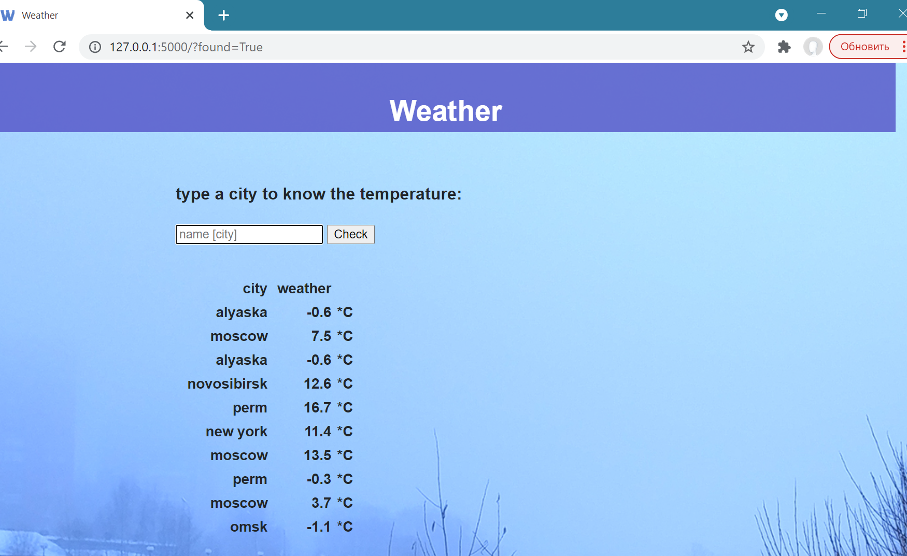

# Weather checker

### Video Demo:  [https://youtu.be/DKPiaEyKfbs](https://youtu.be/DKPiaEyKfbs)

## Description:

The project is a simple `flask web application` which allows a user to check the current weather in the chosen  city.

(made for educational purposes)

The main web-page has:

- a form to ask a user for the name of the city 
- the table from sqlite database with last requests from the user
- the background image (changing depending on the weather)

The app sends an http-request to the site “[api.openweathermap.org]()” to get the information of the temperature.

## How to run locally

- get API key from https://openweathermap.org/ and put it to .env
- set flask app secret key in .env
- python -m venv .venv
- activate virtual environment
- pip install -r requirenments.txt
- flask run

### Toolset:

- Flask
- Jinja2
- sqlite
- pytest